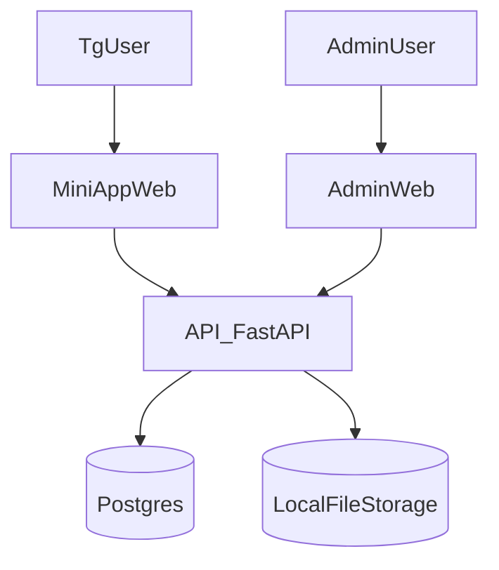

# Архитектура проекта

## Обзор

Telegram Mini App «витрина товаров» состоит из:

- **Telegram Bot** — приветствие и кнопка «Каталог» для запуска Mini App
- **Mini App (витрина)** — SPA для просмотра товаров внутри Telegram
- **Admin Web** — отдельная веб-админка для управления контентом
- **API** — FastAPI backend, единая точка данных и файлов
- **PostgreSQL** — хранение товаров, метаданных
- **Локальное хранилище** — фото и файлы (с возможностью миграции в S3)

## Схема потоков

## Компоненты

| Компонент | Технологии | Назначение |
|-----------|------------|------------|
| services/bot | Python, python-telegram-bot | Приветствие при /start, кнопка «Каталог» (Web App) в меню чата |
| apps/miniapp-web | React, Vite, @telegram-apps/sdk | Витрина товаров, карточка товара, скачивание файлов, кнопка связи |
| apps/admin-web | React, Vite | CRUD товаров, загрузка фото и файлов, ТТХ, публикация |
| services/api | FastAPI, SQLAlchemy, Alembic | REST API, валидация initData, JWT, выдача файлов |
| infra | Docker, nginx, PostgreSQL | Развёртывание и reverse proxy |

## Хранение данных

- **Товары/ТТХ/метаданные** — PostgreSQL
- **Фото и файлы** — директория `storage/` на диске:
  - `storage/products/{product_id}/images/{image_id}/` — изображения
  - `storage/products/{product_id}/attachments/{attachment_id}/` — PDF, спецификации

Абстракция хранилища (`StorageDriver`) позволяет позже перейти на S3.

## Безопасность

- **Админка**: JWT после логина/пароля, rate-limit
- **Mini App**: опционально проверка Telegram `initData` (HMAC по токену бота)
- **Секреты**: только в `.env`, не в коде и не в документации
